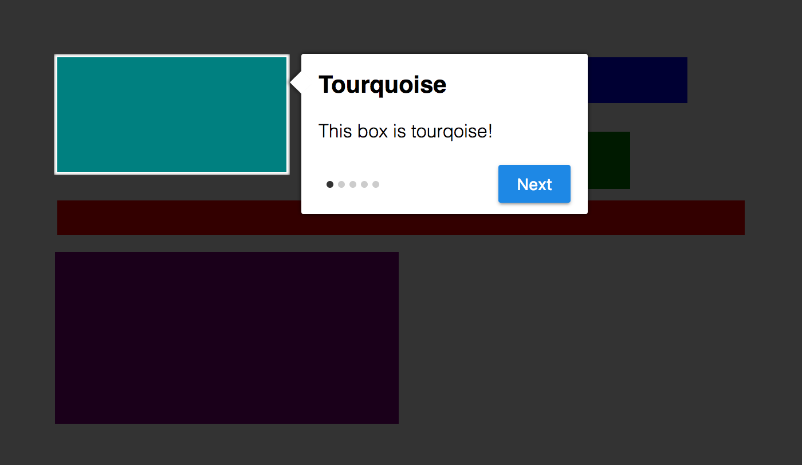

# Tiny Tour
Tiny Tour is a __really__ small JavaScript library for adding a tour to your website.




## Getting Started
Download this library and include it.

```html
<link href="dist/tour.min.css" rel="stylesheet" type="text/css" />
<script src="dist/tour.min.js" rel="stylesheet" type="text/javascript"></script>
```

## Usage

### Creating and starting new tour
```javascript
window.tour = new Tour({
  .. Other tour options
  steps: [
    .. Step Objects
  ]
})

tour.start();
```

### Tour Options

__steps__ - An array of steps that make up the tour.

__padding__ - How much padding is around the element the tip is being
applied to.

__next__ - The text on the next step button.

__done__ - The text on the button when the last tip is displayed.

__prev__ - The text on the previous step button.

### Defining a Step
```javascript
{
  element: ".five",
  title: "Look at me!",
  description: "This is really important",
  position: "[top|bottom|left|right]"
}
```
Any extra attributes in this object will be present in the step object in overridden functions,
such as `showStep`. This can be useful for hiding/showing/creating elements in between steps.

### Overriding Methods

All prototype methods can be overridden to execute code before and after the original method
is executed.  For example, here is how to override the `nextStep` method:

```javascript
tour.override('nextStep', function(self) {
  // Stuff to do before the next step
  self();
  // Stuff to do after the next step
})
```

The first parameter will always be the original method. The parameters normally passed to the
function being overridden will be appended to the arguments list. Overriding a method that takes
an argument, would look like this:

```javascript
tour.override('showStep', function(self, step) {
  // Stuff to do before showing a step
  self(step);
  // Stuff to do after showing a step
})
```

## FAQ

### How do I remove...
Use CSS.

#### the overlay background?
```css
.ttour-overlay {
  box-shadow: none;
}
```

#### the tip title?
```css
.ttour-header {
  display: none;
}
```

#### the tip bullets?
```css
.ttour-bullets {
  display: none;
}
```

### How do I add animations?
Use a combination of CSS and method overrides. For example, this is how
you could add animation to showing/hiding the tip background.

Start with the opacity of the tour overlay set to 0 and add a transition.

```css
.ttour-overlay {
  opacity: 0;
  transition: opacity 0.3s ease-in-out;
}
```

Override the `showStep` and `end` methods to set the transition on show
and hide.

```javascript
tour.override('showStep', function(self, step) {
  self(step);

  setTimeout(function(){
    var overlay = document.getElementsByClassName("ttour-overlay")[0];
    overlay.style.opacity = 1;
  }, 0)
})

tour.override('end', function(self) {
  var overlay = document.getElementsByClassName("ttour-overlay")[0];
  overlay.style.opacity = 0;

  setTimeout(function(){
    self();
  }, 300);
})
```

## Contributing
Bug reports and pull requests are always welcome.
